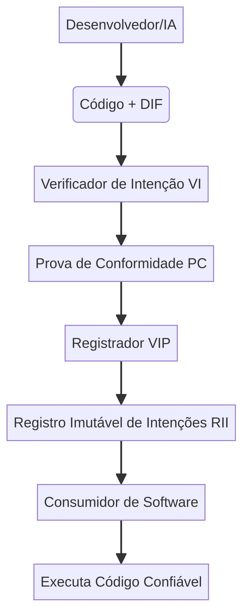

# Verifiable Intent Protocol (VIP)



[](https://github.com/leoregiesdev/verifiable-intent-protocol/blob/main/LICENSE)
[](https://github.com/leoregiesdev/verifiable-intent-protocol/stargazers)
[](https://www.python.org/downloads/)


## O Selo de Qualidade do Futuro para Códigos e IA

Bem-vindo ao **Verifiable Intent Protocol (VIP)**, uma proposta para estabelecer um novo padrão global de confiança e segurança no desenvolvimento de software. O VIP garante que qualquer software — seja ele um microserviço ou módulo Python — execute **exatamente o que foi especificado**, sem comportamentos ocultos ou vulnerabilidades.

### O Problema que o VIP Resolve

- **Incerteza do Código Gerado por IA:** Como ter certeza de que o código faz *apenas* o que foi pedido?
- **Vulnerabilidades e Bugs:** Reduz risco de falhas e brechas.
- **Falta de Confiança:** Comprovação matemática de que o software segue a intenção declarada.

### Como o VIP Funciona

O VIP exige que o código siga um **contrato de intenção** (.vip), criando uma **Prova de Conformidade (PC)** se todas as regras forem respeitadas.

1. **DIF — Declaração de Intenção Formal**  
   Arquivo `.vip` descreve **o que o código pode e não pode fazer**.

```
INTENT contrato
  VERSION 1.0.0

  PERMISSIONS
    ALLOW CPU_COMPUTATION;

  CONSTRAINTS
    DENY NETWORK;
    DENY FILESYSTEM;

  ASSERTIONS
    ON execute ASSERT result_is_correct;
END INTENT
```

2. **Verificação de Código**  
   O VIP Engine analisa o código em relação às regras da DIF.  
   Exemplo de violação:

```
import socket
```

3. **Prova de Conformidade (PC)**  
   Se o código seguir as regras, uma PC é gerada:

```
5674f406003953e8e743f2e767905f99d4b2a77823b14adf71c983b98f307891
```

---

# Quick Start

Testado em **Linux / Termux / Python 3.8+**

## 1️⃣ Clonar o repositório

```
git clone https://github.com/leoregiesdev/verifiable-intent-protocol.git
```

## 2️⃣ Instalar o protocolo

```
pip install -e .
```

Isso instala o comando CLI:

```
vip
```

## 3️⃣ Criar um contrato de intenção

```
vip init contrato
```

Isso cria:

```
contrato.vip
```

## 4️⃣ Criar um módulo Python seguro

```
def execute(data):
    return sorted(data)
```

Salve como:

```
sort_module.py
```

## 5️⃣ Verificar o código

```
vip verify --intent contrato.vip --code sort_module.py
```

Resultado:

```
✅ CÓDIGO APROVADO PELO PROTOCOLO VIP
Prova de Conformidade (PC):
5674f406003953e8e743f2e767905f99d4b2a77823b14adf71c983b98f307891
```

---

# Código Rejeitado

Exemplo:

```
import socket

def execute():
    s = socket.socket()
```

Verificação:

```
vip verify --intent contrato.vip --code bad_module.py
```

Resultado:

```
❌ CÓDIGO REJEITADO - VIOLAÇÃO DETECTADA
Violação: Chamada de rede proibida encontrada: socket.socket
```

---

# Conteúdo do Repositório

* `README.md` – Este arquivo.
* `LICENSE` – Licença MIT.
* `assets/` – Diagramas do protocolo.
* `docs/` – Documentação técnica.
* `vip_cli.py` – Interface de linha de comando.
* `vip_engine.py` – Motor de verificação.
* `vip_dsl_parser.py` – Parser da VIP DSL.
* `setup.py` – Instalação do pacote.

---

### Como Contribuir

Este projeto é open-source e busca colaboração. Abra issues, envie pull requests ou discuta ideias para tornar o software mais seguro e confiável.

---

# Licença

MIT License

Autor original: **leoregiesdev**
